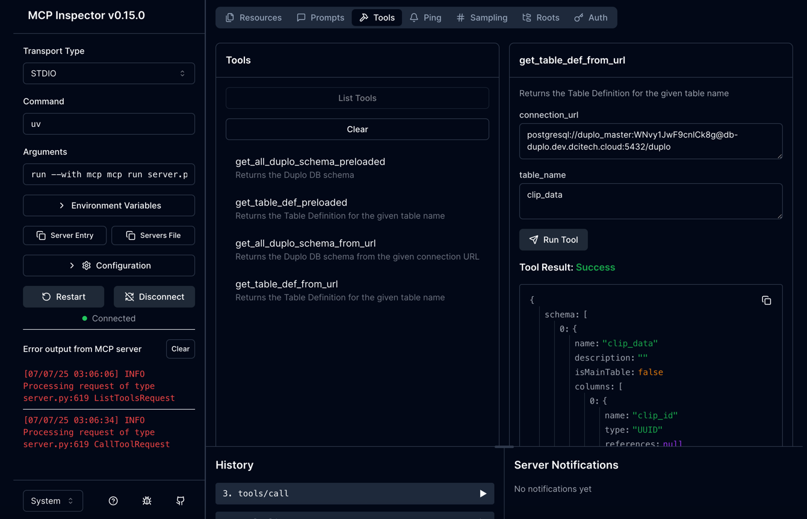

# MCP Servers for Duplo Assistant

A Python app for all MCP Servers for Duplo Assistant

## Setup

1. Start PostgreSQL
2. Start Ollama
3. Install dependencies: `pip install -r requirements.txt`
4. Run app: `python main.py`
5. To run mcp in dev mode: `mcp dev server.py`
6. Open the `Open inspector with token pre-filled:` from the console
7. It should open the MCP inspector 
8. Give the command as `uv`, if `uv` is not already installed pip install it.
9. Arguments: `run --with mcp mcp run server.py`
10. Increase the `Request Timeout` in Configuration if necessary

## Files

- `server.py`: MCP servers for DUPLO
- `main.py`: Entry point
- `mcp.py`: Extracts schema and forms MCP
- `llm.py`: Builds prompt and queries Ollama
- `db.py`: Executes read-only SQL
